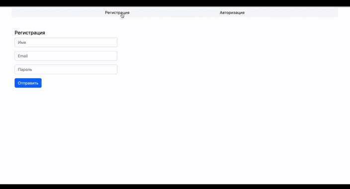

# SSR: Тренировка CRUD операций
## Идея:
Создать иммитацию холодильника, с возможностью добавления и удаления продуктов, а так же редактирования. В холодильник можно попасть только зарегистрированным пользователям 😄
## Функционал:
-   Регистрация и Авторизация;
-   Добавление категории хранения;
-   Добавление продукта в холодильник в соответствии с категорией;
-   Редактирование продукта в холодильнике;
-   Удаление продукта из холодильника;

## Технологии:
Node. js
Express
babel
Webpack
PostgreSQL
sequelize
session
eslint
